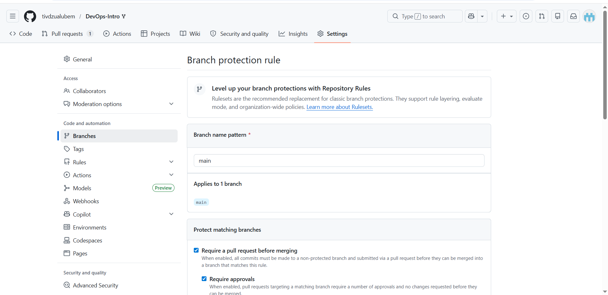

# Lab 1 Submission — DevOps Foundations

## Task 1 — SSH Commit Signing and QuickNotes Run

### QuickNotes health check

Command used:

    curl -s http://localhost:8080/health | python3 -m json.tool

Output:

    {
        "notes": 4,
        "status": "ok"
    }

### QuickNotes notes endpoint before POST

Command used:

    curl -s http://localhost:8080/notes | python3 -m json.tool

Output summary:

    The endpoint returned the four seed notes:
    1. Welcome to QuickNotes
    2. Read app/main.go first
    3. DevOps mantra
    4. Endpoint cheat-sheet

### QuickNotes POST request

Command used:

    curl -s -X POST http://localhost:8080/notes \
      -H 'Content-Type: application/json' \
      -d '{"title":"hello","body":"first POST"}' | python3 -m json.tool

Output:

    {
        "id": 5,
        "title": "hello",
        "body": "first POST",
        "created_at": "2026-06-03T12:25:28.597693886Z"
    }

### QuickNotes notes endpoint after POST

After the POST request, the notes endpoint returned five notes. This confirmed that the new note was created successfully.

### SSH commit signing

SSH commit signing was configured using:

    git config --global gpg.format ssh
    git config --global user.signingkey ~/.ssh/id_rsa.pub
    git config --global commit.gpgsign true
    git config --global tag.gpgsign true

Local SSH signature verification was configured using:

    git config --global gpg.ssh.allowedSignersFile ~/.config/git/allowed_signers

The final commit was verified locally with:

    git log --show-signature -1

The output showed a good SSH signature for tivdzualubem@gmail.com.

### Why signed commits matter

Signed commits matter because Git names and emails can be impersonated, but a valid signature proves that the commit was made using the holder's signing key. This improves software supply-chain trust and helps reviewers verify commit provenance. The xz-utils backdoor case discussed in Lecture 1 shows why identity verification and trusted contribution history are important in real projects.

### Verified badge evidence

The Lab 1 commit shows the GitHub Verified badge on the pull request commit list.

---

## Task 2 — Pull Request Template and First PR

A pull request template was added at:

    .github/pull_request_template.md

The template contains sections for:

    Goal
    Changes
    Testing
    Checklist

This makes the PR easier to review because the reviewer can quickly see what changed, how it was tested, and whether the lab requirements were checked.

The Lab 1 pull request description auto-populated from the template and was completed before opening the PR.

---

## Task 3 — GitHub Community Engagement

Completed actions:

- Starred inno-devops-labs/DevOps-Intro
- Starred simple-container-com/api
- Followed Cre-eD
- Followed Naghme98
- Followed pierrepicaud
- Followed at least 3 classmates

Starring repositories matters because it helps developers bookmark useful projects and increases project visibility. Following developers helps with collaboration because it makes it easier to discover classmates' and maintainers' work, learn from their activity, and build professional connections.

---

## Final Checklist

- [x] QuickNotes health endpoint tested
- [x] QuickNotes notes endpoint tested
- [x] QuickNotes POST endpoint tested
- [x] SSH commit signing configured
- [x] Pull request template added
- [x] Final commit signature verified
- [x] GitHub Verified badge checked
- [x] PR description auto-populated
- [x] GitHub community actions completed

---

## Bonus Task — Branch Protection

**Branch protection on `main`:** require signed commits, pull request before merging, and linear history.



**Unsigned push rejection:**

```text
remote: Bypassed rule violations for refs/heads/main:

remote: - Commits must have verified signatures.
remote:   Found 1 violation:

remote:   3c3ef48c563e3c1c5583f6869a7bc5d20deaeee9

remote: - Changes must be made through a pull request.
```

**Reflection:** Branch protection prevents accidental or malicious direct pushes to important branches. By requiring signed commits, pull requests before merging, and linear history, every change becomes traceable, reviewed, and tied to a verified author. On Knight Capital's deploy day, this kind of protection would not replace proper deployment automation, but it would have blocked unreviewed direct changes and made production-bound changes pass through a controlled review gate. This reduces the risk of unverified or stale code reaching production unnoticed.

