# Lab 8 — SRE and Monitoring

## Overview

This submission extends the Lab 6 QuickNotes Compose stack with Prometheus, Grafana, a provisioned four-panel Golden Signals dashboard, a sustained high-error-rate alert, an operational runbook, and an external Checkly synthetic monitor.

The completed stack contains:

- QuickNotes on port `8080`
- Prometheus `v3.12.0` on port `9090`
- Grafana `v13.0.1` on port `3000`
- A provisioned Prometheus data source
- A provisioned QuickNotes Golden Signals dashboard
- A Prometheus alert for a sustained error ratio above 5%
- A Checkly API check from Frankfurt and Singapore
- A QuickNotes request-duration histogram for real internal P50 and P95 latency

---

# Task 1 — Prometheus and Grafana

## Configuration Files

The implementation is stored in the following files:

- [Compose stack](../compose.yaml)
- [Prometheus configuration](../monitoring/prometheus/prometheus.yml)
- [Grafana data-source provisioning](../monitoring/grafana/provisioning/datasources/datasource.yml)
- [Grafana dashboard-provider provisioning](../monitoring/grafana/provisioning/dashboards/dashboard.yml)
- [Golden Signals dashboard JSON](../monitoring/grafana/dashboards/golden-signals.json)
- [Request-duration histogram implementation](../app/request_duration_metrics.go)
- [Request-duration histogram tests](../app/request_duration_metrics_test.go)
- [Environment-variable example](../.env.example)

The actual local `.env` file contains generated Grafana credentials, is excluded from Git, and is not committed.

## Prometheus Configuration

Prometheus uses a global scrape interval of 15 seconds and one scrape job for QuickNotes. The target uses the Compose service name and internal application port:

```yaml
global:
  scrape_interval: 15s

rule_files:
  - /etc/prometheus/alerts.yml

scrape_configs:
  - job_name: quicknotes
    static_configs:
      - targets:
          - quicknotes:8080
```

Using `quicknotes:8080` allows Docker Compose DNS to resolve the application inside the shared Compose network.

## Prometheus Target Verification

The target API was queried with:

```bash
curl -s http://localhost:9090/api/v1/targets |
jq -r '.data.activeTargets[] |
select(.labels.job == "quicknotes") |
.health'
```

Output:

```text
up
```

Prometheus target evidence:

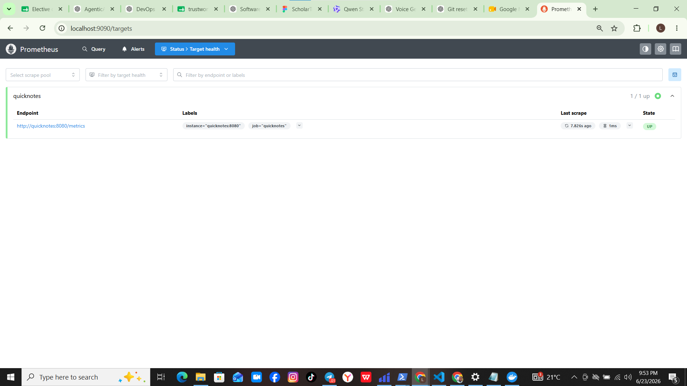

## Grafana Provisioning

Grafana automatically loads:

1. A default Prometheus data source using `http://prometheus:9090`.
2. The dashboard-provider configuration.
3. The Golden Signals dashboard JSON from the mounted dashboard directory.

No manual dashboard creation is required when the stack is recreated.

## Golden Signals Dashboard

The dashboard contains exactly four panels:

| Golden signal | Panel query or metric | Purpose |
|---|---|---|
| Latency | `histogram_quantile()` over `quicknotes_http_request_duration_seconds_bucket` | Internal HTTP request P50 and P95 latency |
| Traffic | `rate(quicknotes_http_requests_total[5m])` | Requests processed per second |
| Errors | Ratio of 4xx and 5xx responses to all responses | Percentage of requests that fail |
| Saturation | `quicknotes_notes_total` | Current number of stored notes |

QuickNotes was extended with the Prometheus histogram `quicknotes_http_request_duration_seconds`. The Latency panel now calculates real P50 and P95 values using `histogram_quantile()`.

Mixed successful and failing traffic was used to validate the Traffic and Errors panels. After adding the request-duration histogram, additional successful requests were generated to populate the P50 and P95 latency series.

Dashboard evidence:

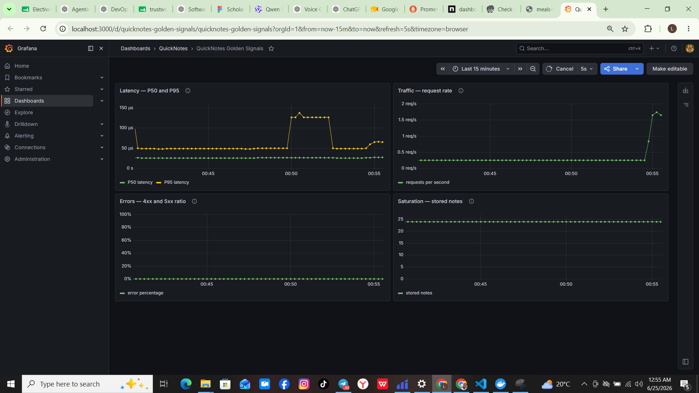

## Task 1 Design Questions

### a) Pull versus push

Prometheus uses a pull model, so Prometheus must be able to initiate a connection to the QuickNotes `/metrics` endpoint. QuickNotes does not need to know the Prometheus address or push metrics to it.

If Prometheus cannot reach QuickNotes, the target becomes unavailable and the `up` metric becomes `0`. Prometheus stops receiving fresh application samples, and previously collected series eventually become stale. This may indicate application failure, DNS failure, network isolation, an incorrect target address, or a blocked port.

### b) Effects of changing the scrape interval

Changing the scrape interval from 15 seconds to 5 seconds triples the number of stored samples, network requests, disk writes, and query-processing work. It may also produce noisy short-window rates without adding useful operational information.

Changing it to 5 minutes creates severe under-sampling. Short incidents may begin and end between scrapes, dashboards update slowly, and alerts may take several minutes to detect a problem. Rate calculations also become unreliable when a selected range contains too few samples.

A 15-second interval gives a reasonable balance between detection speed, resolution, and resource cost for this lab.

### c) `rate()` versus `irate()` versus `delta()`

`rate()` is appropriate for the Traffic panel because `quicknotes_http_requests_total` is a monotonically increasing counter. It calculates the average per-second increase across the selected range and handles counter resets.

`irate()` uses only the final two samples and is more sensitive to short spikes, making a dashboard visually unstable. It is useful for highly responsive troubleshooting but less suitable for a general operational traffic graph.

`delta()` calculates the change in a gauge over a range. It is not the correct function for request counters and does not provide the same counter-reset handling as `rate()`.

### d) Why provision Grafana from files?

File-based provisioning makes the monitoring environment reproducible. A new stack automatically receives the same data source, dashboard, queries, titles, and panel layout.

The files can be version-controlled, code-reviewed, tested, compared through Git diffs, and restored after failure. Manual UI configuration is difficult to reproduce and can drift between developers or environments.

---

# Task 2 — High Error Rate Alert

## Alert Rule

The complete Prometheus rule is stored at:

[monitoring/prometheus/alerts.yml](../monitoring/prometheus/alerts.yml)

The rule:

- Calculates the ratio of 4xx and 5xx responses to all responses.
- Fires when the error ratio exceeds `0.05`.
- Requires the condition to remain true for five minutes.
- Uses the label `severity: page`.
- Contains an annotation linking to the runbook.

The principal rule structure is:

```yaml
- alert: QuickNotesHighErrorRate
  expr: |
    (
      sum(rate(quicknotes_http_responses_by_code_total{code=~"4..|5.."}[1m]))
      /
      sum(rate(quicknotes_http_requests_total[1m]))
    ) > 0.05
  for: 5m
  labels:
    severity: page
```

## Alert Trigger Procedure

The executable script below generated one healthy request and one malformed request every second:

[monitoring/scripts/generate-high-error-traffic.sh](../monitoring/scripts/generate-high-error-traffic.sh)

The malformed requests produced a sustained error ratio greater than 5%.

The alert correctly transitioned through:

```text
Inactive → Pending → Firing
```

Pending-state evidence:

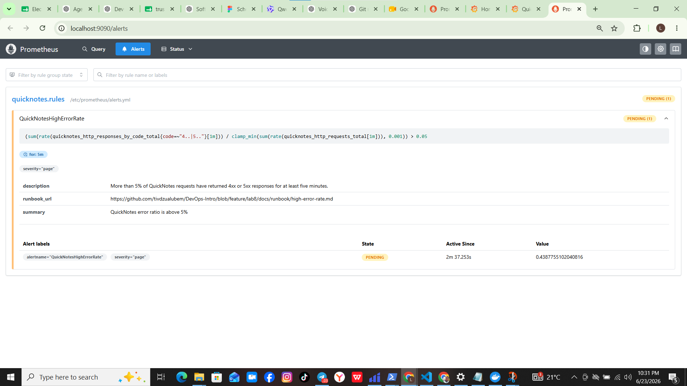

Firing-state evidence:

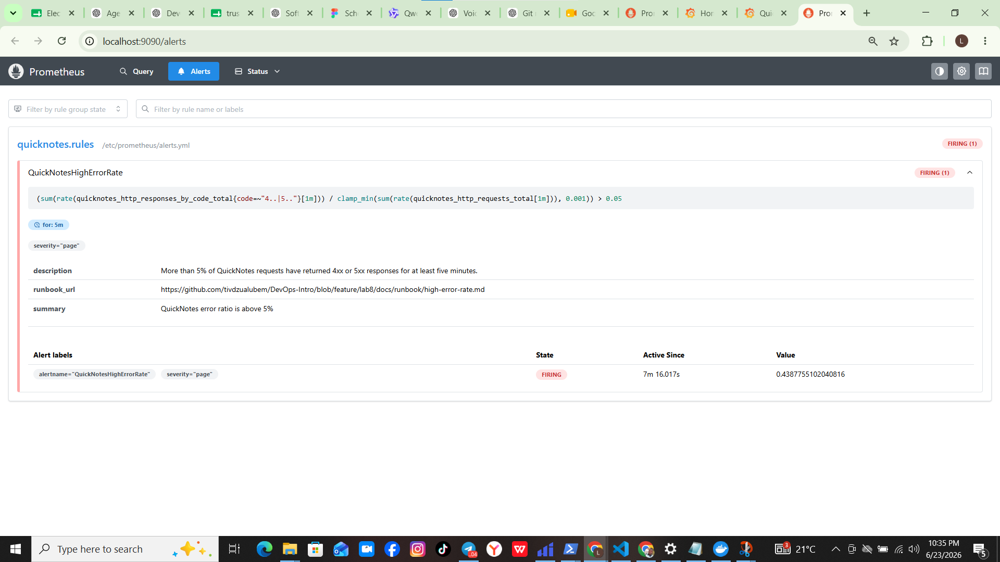

After the error-generating process was stopped, the alert returned to the inactive state.

## Runbook

The repository runbook is available at:

[docs/runbook/high-error-rate.md](../docs/runbook/high-error-rate.md)

### What this alert means

More than 5% of QuickNotes HTTP responses have been 4xx or 5xx responses continuously for at least five minutes, indicating sustained user-visible request failures.

### Triage Steps

1. Confirm the alert state, error ratio, start time, severity label, and five-minute duration in Prometheus.

2. Verify the service state and health:

       docker compose ps
       curl -i http://localhost:8080/health
       docker compose logs --tail=100 quicknotes

3. Inspect the response-code counters and determine whether failures are primarily 4xx or 5xx:

       curl -s http://localhost:8080/metrics |
       grep quicknotes_http_responses_by_code_total

4. Check for recent application, Compose, configuration, or traffic changes that coincide with the beginning of the alert.

5. Determine whether a test or load-generation process is intentionally producing malformed requests and stop it when appropriate.

### Mitigations

1. Roll back the latest application or configuration change and redeploy the last known-good QuickNotes image.

2. Block, rate-limit, or disable a malfunctioning client that is continuously sending invalid requests.

3. Restart the QuickNotes service only when evidence indicates that the process is unhealthy or stuck:

       docker compose restart quicknotes

4. Restore any unavailable dependency or persistent-data path identified during triage.

### Post-Incident

After mitigation:

1. Confirm that `/health` returns HTTP 200.
2. Confirm the error ratio returns below 5%.
3. Confirm the alert returns to inactive.
4. Record the incident timeline, user impact, detection method, root cause, contributing factors, and mitigation.
5. Create a blameless postmortem with assigned action items, owners, and completion dates following the Lecture 1 postmortem structure.

## Task 2 Design Questions

### e) Why require a five-minute sustained breach?

A single malformed request or short traffic burst does not necessarily indicate an incident. Requiring five minutes filters temporary noise, client mistakes, brief deployments, and isolated failures.

The delay reduces false pages and prevents alert flapping while still detecting a sustained user-visible problem. A paging alert should represent a condition that requires human action rather than every individual error.

### f) Symptom alerts versus cause alerts

A possible cause alert would be:

```text
QuickNotes CPU usage is greater than 80%.
```

This is worse as a paging condition because high CPU may occur during legitimate work while users continue receiving successful responses. It may therefore wake an operator when there is no user impact.

It can also miss incidents caused by network failure, bad requests, storage failure, configuration errors, or application bugs. The error-ratio alert directly measures the symptom users experience regardless of the underlying cause.

### g) Quantitative alert-fatigue threshold

The alert should be considered too noisy if more than 10% of its pages occur when users are not measurably affected. This corresponds to alert precision below 90%.

At that point, the threshold, evaluation window, traffic filters, or severity should be reviewed. Repeated false pages train operators to ignore alerts and increase the risk that a genuine incident will be missed.

---

# Bonus — External Synthetic Monitoring

## Public Deployment

A temporary Cloudflare Quick Tunnel exposed the QuickNotes health endpoint publicly. The tunnel and the real Lab 8 Compose stack ran on a GitHub-hosted Actions runner because the local network blocked tunnel registration.

The implementation is stored at:

[.github/workflows/lab8-external-monitor.yml](../.github/workflows/lab8-external-monitor.yml)

The workflow:

1. Checks out `feature/lab8`.
2. Generates runtime-only Grafana credentials.
3. Starts QuickNotes, Prometheus, and Grafana with Docker Compose.
4. Creates an accountless Cloudflare Quick Tunnel.
5. Waits for DNS propagation and HTTP 200 readiness.
6. Maintains the tunnel for 45 minutes.
7. Performs one external health request every minute.
8. Queries Prometheus for the final 30-minute P50, P95, request count, and error count.
9. Cleans up the Compose stack after completion.

Initial successful GitHub Actions evidence:

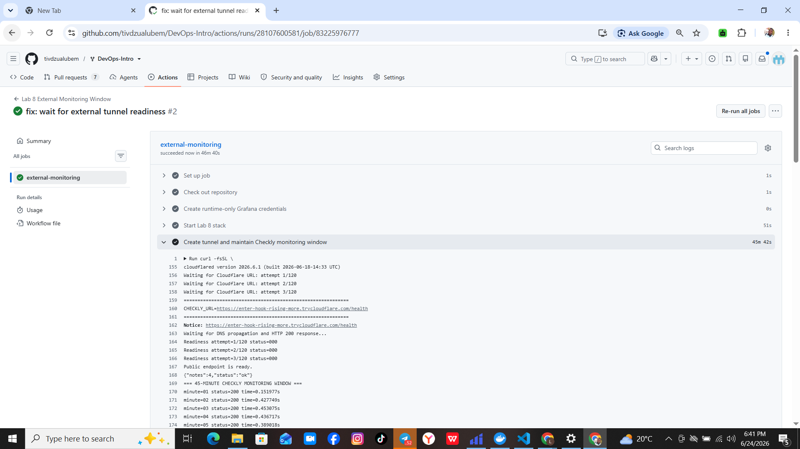

## Checkly Configuration

The Checkly API check was configured with:

| Setting | Value |
|---|---|
| Check name | QuickNotes External Health |
| Method | GET |
| Path | `/health` |
| Frequency | Every 1 minute |
| Scheduling | Parallel runs |
| Locations | Frankfurt and Singapore |
| Status assertion | Status code equals 200 |
| Latency assertion | Response time less than 2000 ms |
| Alerting | Enabled |

Initial assertion evidence:

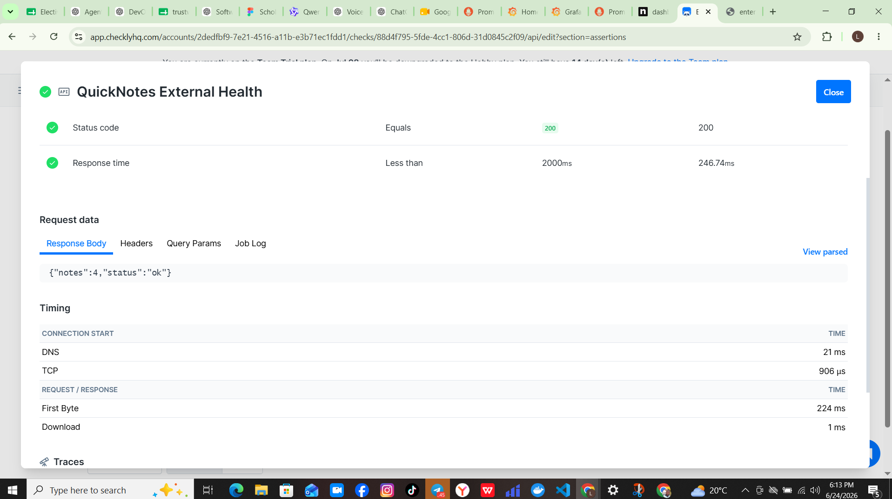

Frequency evidence:

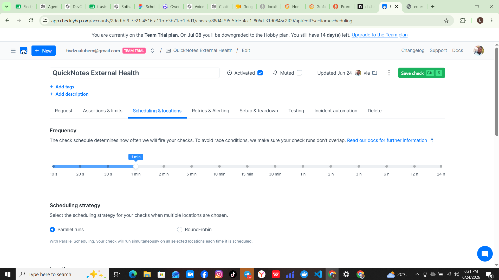

Location evidence:

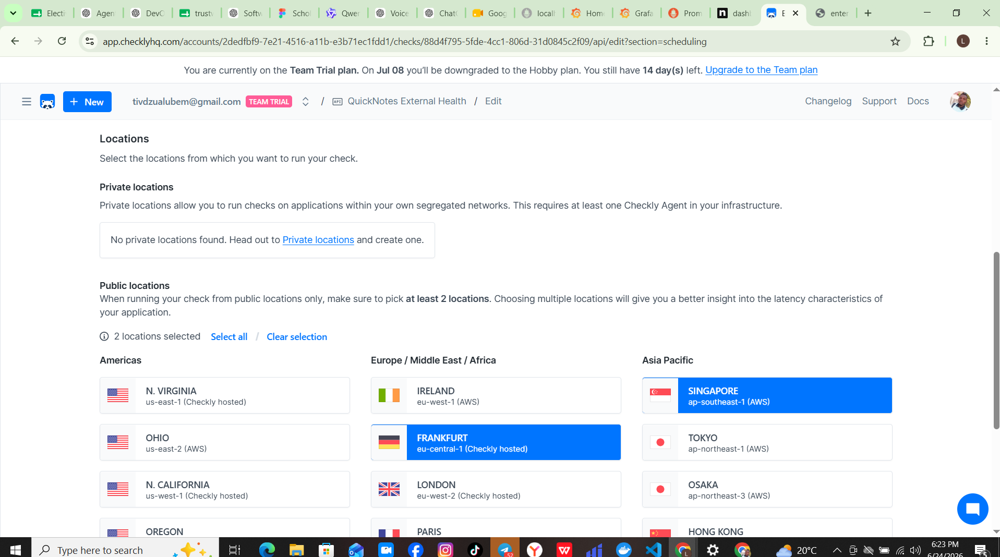

Same-window assertion evidence:

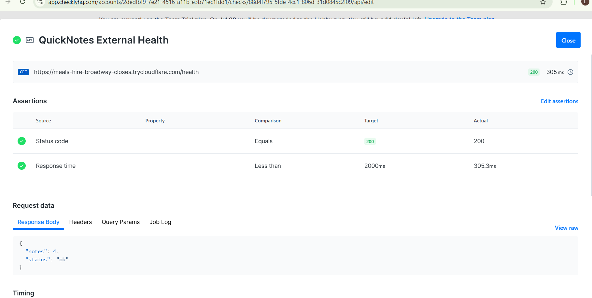

## Checkly Results

The definitive comparison used the same 30-minute interval in Prometheus and Checkly:

```text
2026-06-24 20:44:56 UTC to 2026-06-24 21:14:56 UTC
```

This corresponds approximately to `23:44:56` on June 24 through `00:14:56` on June 25 in the local UTC+3 time zone.

The selected Checkly window produced:

- Availability: `100%`
- Failure alerts: `0`
- Retry ratio: `0%`
- Median latency, P50: `374 ms`
- P95 latency: `1.09 s`
- Successful parallel runs from Frankfurt and Singapore
- No assertion failures within the selected comparison window

Initial 31-minute monitoring evidence:

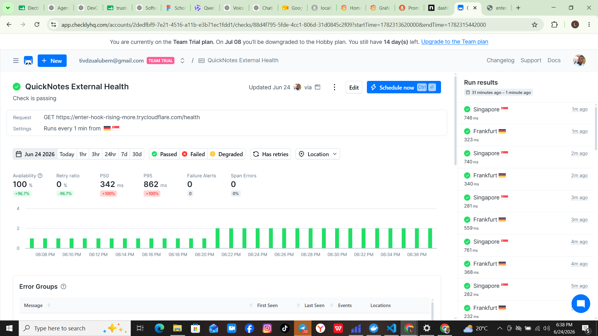

Definitive same-window evidence:

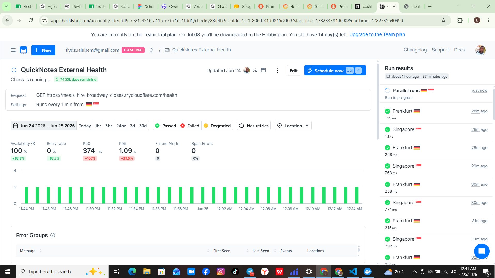

## Internal versus External Comparison

Prometheus and Checkly were compared over the same final 30-minute monitoring window. Prometheus measured QuickNotes handler execution inside the Compose environment, while Checkly measured the complete public path from Frankfurt and Singapore.

| Measurement | Prometheus inside Compose | Checkly external monitoring |
|---|---:|---:|
| Window start | 2026-06-24 20:44:56 UTC | 2026-06-24 20:44:56 UTC |
| Window end | 2026-06-24 21:14:56 UTC | 2026-06-24 21:14:56 UTC |
| Request latency P50 | 0.0252 ms | 374 ms |
| Request latency P95 | 0.0478 ms | 1.09 s |
| HTTP 4xx/5xx errors | 0 | 0 |
| Requests observed | Approximately 565 | Parallel checks every minute |
| Availability | Prometheus target `up = 1` | 100% |

The workflow reported approximately `564.71` requests because Prometheus `increase()` extrapolates counters to the exact time-range boundaries.

The external values are higher because Checkly includes DNS resolution, TCP and TLS establishment, Cloudflare Tunnel processing, internet routing, and regional network latency. Prometheus measures only the application handler execution inside the Compose environment.

The histogram excludes `/metrics` requests so that Prometheus scraping does not distort the application-request latency distribution.

Prometheus same-window evidence:

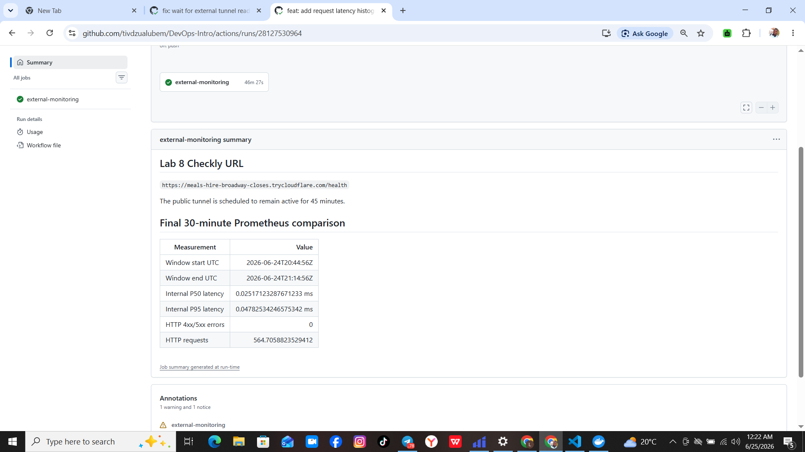

## Failure-Mode Analysis

Checkly can detect failures outside the Compose network, including DNS failure, TLS problems, Cloudflare tunnel failure, internet routing problems, regional connectivity problems, and a public endpoint that is unreachable even though the containers are internally healthy.

Prometheus can detect detailed internal application conditions that a simple external `/health` check cannot see, including increasing error counters, stored-note saturation, scrape failure, unusual traffic rates, and problems affecting endpoints other than `/health`.

Checkly measures the experience of an external client across the complete network path. Prometheus provides higher-resolution service telemetry and explains what is happening inside the application environment.

Using both provides stronger coverage than either system alone.

---

# Final Verification Summary

| Requirement | Result |
|---|---|
| Prometheus target `up == 1` | Passed |
| Prometheus scrape interval is 15 seconds | Passed |
| Grafana data source provisioned | Passed |
| Grafana dashboard provisioned | Passed |
| Four Golden Signals panels present | Passed |
| Real P50 and P95 latency panel present | Passed |
| Dashboard contains non-trivial data | Passed |
| Error-ratio rule exceeds 5% threshold | Passed |
| Five-minute sustained gate | Passed |
| `severity: page` label | Passed |
| Runbook annotation | Passed |
| Alert observed pending | Passed |
| Alert observed firing | Passed |
| Runbook contains all required sections | Passed |
| Checkly frequency is one minute | Passed |
| Two external regions | Passed |
| Status assertion equals 200 | Passed |
| Response-time assertion below two seconds | Passed |
| Monitoring duration at least 30 minutes | Passed |
| Prometheus and Checkly used the same comparison window | Passed |
| Real Prometheus P50 and P95 values recorded | Passed |
| Checkly P50 and P95 recorded | Passed |
| All commits signed | Passed |
| Secrets excluded from Git | Passed |
